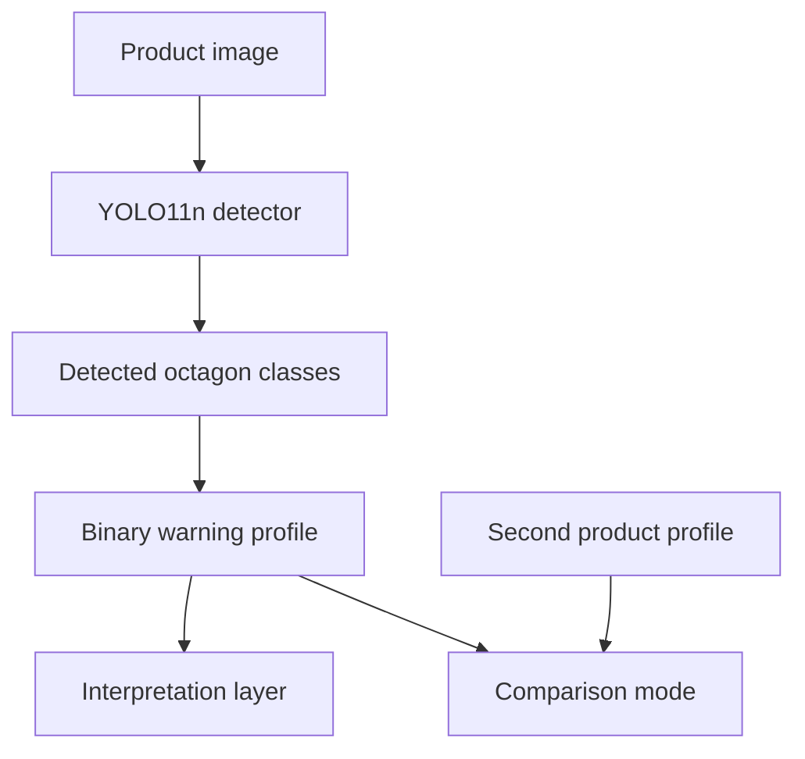

# OctaReader architecture

## Processing chain

## Detector output

The detector predicts exactly four warning classes:

- `alto_azucar`
- `alto_sodio`
- `alto_grasas_saturadas`
- `contiene_grasas_trans`

Multiple detections are aggregated at product level. Downstream logic operates on the warning set rather than duplicate bounding boxes.

## Comparison semantics

Comparison is intentionally categorical. No nutrient magnitude is inferred from the warning label.
